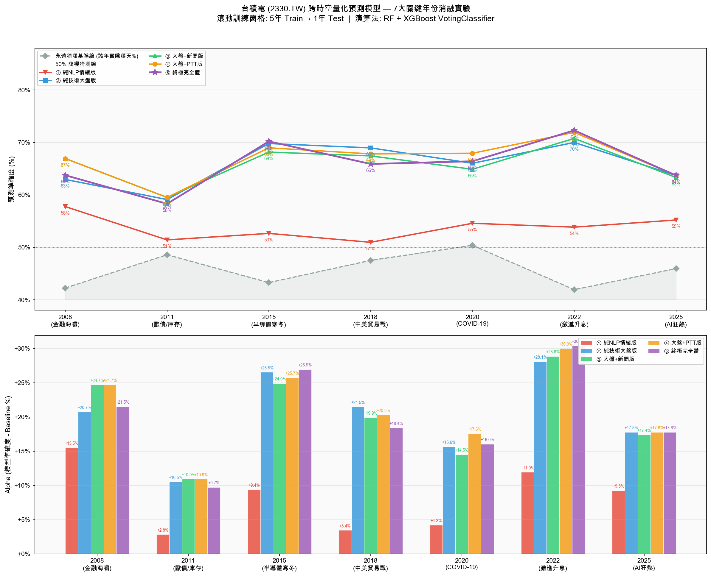
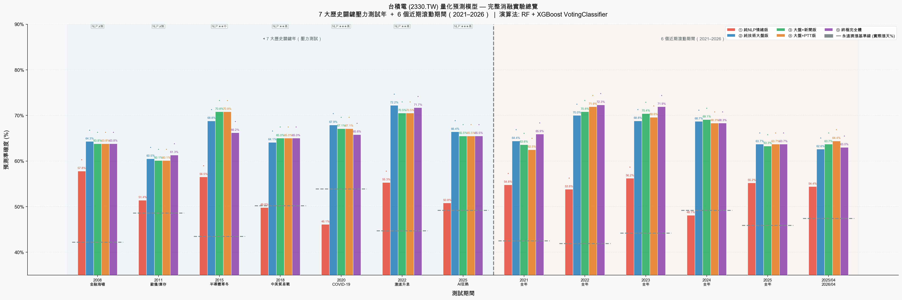
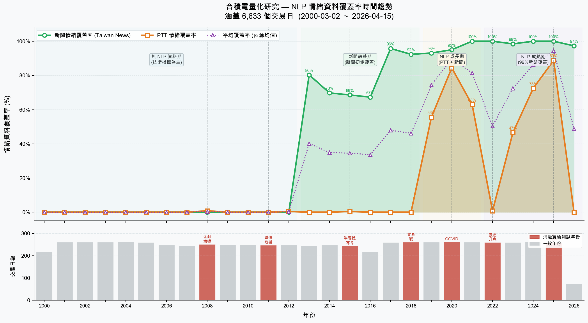
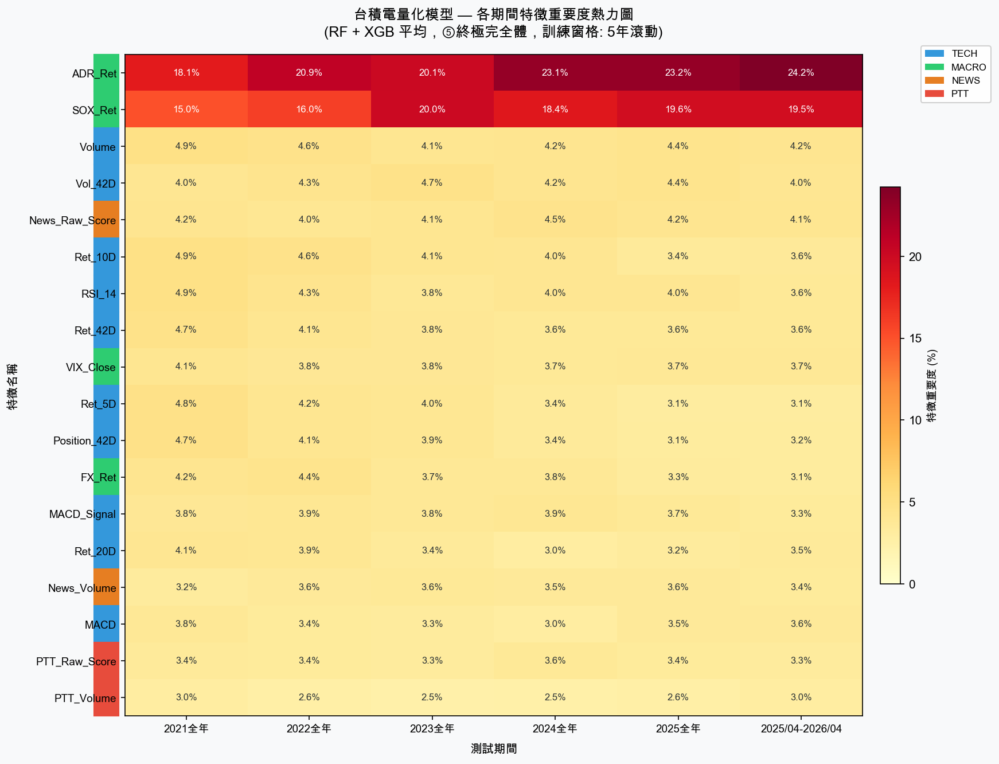

# 台積電跨時空量化預測系統

**TSMC Cross-Era Quantitative Prediction System — NLP Sentiment × Technical Analysis, 26-Year Stress Test**

結合鉅亨網財經新聞、PTT 股板社群情緒與技術／總經指標，以 **Text2Vec 語義分析** 與 **Random Forest + XGBoost 集成模型**，對台積電（2330.TW）2000–2026 共 26 年、6,633 個交易日進行消融式壓力測試。

> 次日漲跌方向準確度達 **61–72%**，相較「永遠猜漲」基準提升 **+12 ～ +27 個百分點**。

---

## 核心研究問題

> 結合 NLP 情緒分析（新聞 + PTT）與技術／總經指標，是否能在不同市場情境（金融危機、疫情、升息循環）下，**顯著提升**台積電次日漲跌方向的預測準確度？

## 研究貢獻

1. **資料廣度** — 涵蓋台積電 26 年（2000–2026）的多源融合預測矩陣（22 欄 × 6,633 筆）
2. **跨情境驗證** — 7 個歷史關鍵年份的滾動式壓力測試（Stress Testing）
3. **情緒量化** — 以 Text2Vec 將中文財經文本轉為連續情緒分數
4. **可重現性** — 全流程開源，並提供 Look-Ahead Bias 三層驗證報告

---

## 實驗結果：七大危機年份消融測試

五種特徵組合 × 7 個壓力年份，全部採滾動式時間序列切分（前 5 年訓練 → 次年測試），杜絕未來資訊洩漏。

| 年份 | 情境 | 永遠猜漲 | ① 純NLP | ② 純技術大盤 | ③ 大盤+新聞 | ④ 大盤+PTT | ⑤ 終極完全體 | Alpha |
|------|------|---------:|--------:|-------------:|------------:|-----------:|-------------:|------:|
| 2008 | 金融海嘯 | 42.2% | 57.8% | 64.3% | 63.8% | 63.8% | 63.8% | **+21.6** |
| 2011 | 歐債／庫存 | 48.6% | 51.4% | 60.5% | 60.1% | 60.1% | 61.3% | **+12.8** |
| 2015 | 半導體寒冬 | 43.5% | 56.5% | 68.8% | **70.8%** | 70.8% | 66.2% | **+22.8** |
| 2018 | 中美貿易戰 | 50.2% | 49.8% | 64.1% | 65.0% | 65.0% | 65.0% | **+14.8** |
| 2020 | COVID-19 | 53.9% | 46.1% | **67.9%** | 67.1% | 67.1% | 65.8% | **+11.9** |
| 2022 | 激進升息 | 44.7% | 55.3% | **72.2%** | 70.5% | 70.5% | 71.7% | **+27.0** |
| 2025 | AI 狂熱 | 49.2% | 50.8% | 66.4% | 65.5% | 65.5% | 65.5% | **+16.3** |

### 四個關鍵發現

1. **技術＋總經特徵（②）是最穩定的核心** — 在 7 個年份中皆穩定落在 60–72%，是模型的骨幹。VIX 與 SOX 費半指數的特徵重要度合計常超過 30%。
2. **NLP 情緒在特定情境有加分效果** — 2015 半導體寒冬（新聞版 +2.0pp）、2022 升級息（完全體 +1.5pp 對比純技術）等資訊密集年份，語言情緒確實帶來增益。
3. **純 NLP 情緒版（①）在覆蓋稀疏年份等同隨機猜測** — 2018、2020 落到 50% 以下，說明情緒訊號需要足夠的文本覆蓋率才有意義，不能單獨作為策略。
4. **終極完全體（⑤）未必最優** — 特徵愈多不等於愈好；在部分年份反而因維度增加而稀釋了核心訊號，體現了特徵選擇的取捨。

<p align="center">
  
</p>

<p align="center">
  
  
</p>

<p align="center">
  
</p>

---

## 系統架構

```
資料層  ──  yfinance（2330.TW / TSM / ^VIX / ^SOX / USDTWD）
            鉅亨網 cnyes API（財經新聞 15,330 篇）
            PTT Stock 板爬蟲（社群討論）
              ↓
NLP 層  ──  Text2Vec（shibing624/text2vec-base-chinese）
            Bullish / Bearish 錨定向量 → Cosine Similarity → 0~1 情緒分數
              ↓
特徵層  ──  RSI(14)、MACD(12,26,9)、多時框報酬（5/10/20/42D）
            年化滾動波動率、42 日相對位階、成交量
            VIX、SOX 報酬、ADR 報酬、匯率報酬
              ↓
模型層  ──  StandardScaler → VotingClassifier(soft)
                              ├─ RandomForest (300 trees, depth 6)
                              └─ XGBoost (300 est, depth 4, lr 0.05)
              ↓
驗證層  ──  滾動時間序列切分（前 5 年訓練 → 次年測試）
            5 種特徵組合 × 7 個壓力年份消融實驗
```

### 程式架構

```
├── config.py                     # 全域設定（API、模型參數、特徵參數、錨定句）
├── main.py                       # 主執行流程（Phase 1–4）
├── crawlers/
│   ├── market_data.py            # yfinance 市場資料爬蟲
│   ├── ptt_crawler.py            # PTT Stock 板爬蟲
│   └── news_crawler.py           # 鉅亨網歷史 + 即時新聞爬蟲
├── processing/
│   ├── technical_indicators.py   # RSI、MACD、動能因子計算
│   ├── sentiment_processor.py    # Text2Vec 情緒分析引擎
│   └── matrix_builder.py         # 四源融合超級矩陣組裝
├── models/
│   ├── prediction_model.py       # 消融實驗、模型訓練
│   └── feature_study.py          # 特徵重要度分析
├── data/
│   ├── raw/                      # 原始爬蟲資料（market / news / ptt）
│   └── processed/                # Text2Vec 情緒分數快取
├── output/
│   ├── academic_report.md        # 完整技術報告（628 行）
│   ├── TSMC_matrix_2000-2026.csv # 超級矩陣（22 欄 × 6,633 筆）
│   ├── ablation_results.csv      # 消融實驗數值結果
│   └── *.png                     # 圖表輸出
├── TSMC/                         # 分析 Notebook 與中間矩陣
└── LTCM優化/                      # LTCM 案例延伸研究
```

---

## 快速開始

```bash
git clone https://github.com/<your-username>/tsmc-sentiment-quant.git
cd tsmc-sentiment-quant

python -m venv quant_env
source quant_env/bin/activate        # Windows: quant_env\Scripts\activate
pip install -r requirements.txt
```

執行流程：

```bash
python main.py                    # 執行全部 Phase（爬蟲 → NLP → 矩陣 → 消融實驗）
python main.py --phase 4          # 只跑消融實驗（需已有矩陣）
python main.py --skip-crawl       # 跳過爬蟲，直接從快取組裝
python main.py --phase 1 --force  # 強制重新爬蟲
```

> 儲存庫已附上 `data/` 與 `output/` 的中間結果，因此可直接執行 `--phase 4` 重現本文全部實驗數據，無須重跑數小時的爬蟲與 NLP 推論。

---

## Look-Ahead Bias 驗證

預測類專案最常見的致命瑕疵是未來資訊洩漏。本專案以三個層次驗證：

| 層次 | 方法 | 結果 |
|------|------|------|
| 一 | 程式碼逐行審查所有 rolling / shift 操作 | 全數確認僅使用 t 時點以前資料 |
| 二 | 數值驗證 `Ret_5D` 是否確為過去 5 日報酬 | max_diff = 5.41 × 10⁻¹⁶（浮點精度誤差） |
| 三 | `Target_Binary` 與次日報酬方向比對 | 吻合度 1.000000（100%） |

此外另建「乾淨矩陣」對照實驗，重新獨立計算全部特徵後準確度無顯著變化，確認結果非洩漏所致。完整驗證報告見 [`output/academic_report.md`](output/academic_report.md) 第捌章。

---

## 研究侷限

- **NLP 覆蓋率不均** — 2000–2015 的中文財經文本可取得性遠低於近年，早期情緒特徵訊號稀疏
- **方向性預測 ≠ 可交易策略** — 本研究預測次日漲跌方向，未計入交易成本、滑價與部位管理
- **單一標的** — 結論建立在台積電上，尚未驗證能否推廣至其他半導體或非科技類股
- **情緒錨定句主觀性** — Bullish / Bearish 錨定向量由人工撰寫，不同措辭會影響分數分布

## 技術棧

`Python 3.13` · `pandas` · `numpy` · `scikit-learn` · `XGBoost` · `sentence-transformers` · `yfinance` · `BeautifulSoup4` · `matplotlib`

---

## 完整報告

詳細方法論、超參數選擇理由、逐年覆蓋率統計與假說驗證結果，見 **[`output/academic_report.md`](output/academic_report.md)**。
